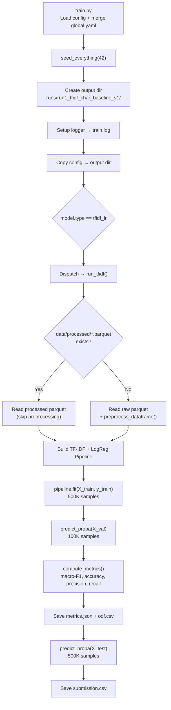

## Run 1 — TF-IDF char n-gram + LogReg: Execution Flow

```
python src/train.py --config configs/run1_tfidf_char_baseline_v1.yaml
```

### Trình tự chạy:



### Chi tiết từng bước:

| # | Bước | Mô tả |
|---|------|--------|
| 1 | **Config merge** | `run1_*.yaml` inherits `global.yaml` via `dict.update()` — run config overrides global defaults |
| 2 | **Seed** | Fix random state (42) cho reproducibility |
| 3 | **Data loading** | **[MỚI]** Ưu tiên `data/processed/{train,val,test}_clean.parquet`. Nếu không có → fallback load raw + `preprocess_dataframe()` |
| 4 | **TF-IDF vectorizer** | `char_wb` analyzer, ngram (3,5), max 200K features, sublinear TF |
| 5 | **LogReg fit** | C=4.0, balanced class weight, LBFGS solver, max 1000 iter, n_jobs=-1 |
| 6 | **Validation** | Predict probabilities → threshold 0.5 → compute macro-F1 |
| 7 | **Save outputs** | `metrics.json`, `oof.csv` (val predictions), `submission.csv` (test predictions) |

### Output artifacts:
```
runs/run1_tfidf_char_baseline_v1/
├── config.yaml        # copy of config used
├── train.log          # full training log
├── metrics.json       # {"run_name": ..., "validation": {"random": {macro_f1, accuracy, ...}}}
├── oof.csv            # prob, pred, true for 100K val samples
└── submission.csv     # ID, label for 500K test samples
```